# Phishing Email Investigation Report  
**Analyst:** Seif Tuhul  
**Date:** August 9, 2025  

---

## Overview  
Phishing remains one of the most common and dangerous cybersecurity threats, where attackers impersonate trusted entities to steal sensitive information such as credentials, financial data, or install malware. This report analyzes three phishing URLs sourced from PhishTank, a reputable community-driven phishing repository. Using VirusTotal and Any.Run sandbox tools, the URLs were scanned and analyzed for indicators of compromise (IOCs). Two URLs showed suspicious characteristics, while one appeared clean. The goal is to extract relevant IOCs, summarize findings, and recommend mitigations.

---

## Tools Used  
- PhishTank: For gathering active phishing URL samples  
- VirusTotal: Multi-engine URL and file scanning  
- Any.Run: Dynamic sandbox analysis for behavioral insights  
- MXToolbox: Email header analysis (not applied here as no email samples)  

---

## URL Analysis  

### URL 1: https://nvq0ac.top/DyIBDPO9HV/login&getFlg=on/  
- VirusTotal: No significant detections; rated clean to medium risk  
- Sandbox: No suspicious activity detected during dynamic analysis  
- Notes: URL may be inactive or low-risk phishing landing page  

### URL 2: https://serviceuzg.cyou/us/index.html  
- VirusTotal: Flagged as suspicious by multiple detection engines  
- Sandbox: Browser process (msedge.exe) executed; network connections to suspicious IPs; multiple dropped files observed  
- Notes: Potential phishing landing page with associated malicious scripts  

### URL 3: http://daspol-eu.s10.hostcreators.sk/img/fi/  
- VirusTotal: Flagged suspicious by multiple engines  
- Sandbox: Similar behavior to URL 2 with dropped files and network connections  
- Notes: Active phishing URL hosting potentially malicious content  

---

## Indicators of Compromise (IOCs)  

### For https://serviceuzg.cyou/us/index.html  
- **Phishing URL:** https://serviceuzg.cyou/us/index.html  
- **Dropped files (SHA256):**  
  - cc6aecf8-6480-4eb0-94fe-30fcdeecf5f0.tmp — cdb4ee2aea69cc6a83331bbe96dc2caa9a299d21329efb0336fc02a82e1839a8  
  - coupons_data.db\000017.ldb — 50d42197b44f33e1a778c82a210db43dde3e3972716bbfe41f71a86ae1a1e03a  
  - Last Browser — 9c70f766d3b84fc2bb298efa37cc9191f28bec336329cc11468cfadbc3b137f4  
  - page_embed_script.js — 8ba9b01fe8eb16e6673b7e5341697ec449026ca902d3f16305924d853a339ad8  
  - service_worker_bin_prod.js — 58bf445f708c392ab82e2cdd45e3633bb5e83252f5eeac897d90eb65b0d16151  
  - offscreendocument_main.js — 8000ba1c3e8a760839707872c5efd133077ab39ef1ff53b818a3ffacea5021d4  
  - the-real-index — 7c336dd1b93b3f0ed5e368d566653e7a8bdb552287d050f56dd9db1dd249fb7c  
- **DNS Request Domain:** serviceuzg.cyou  
- **Network Connection IP:** 43.130.60.113  

### For http://daspol-eu.s10.hostcreators.sk/img/fi/  
- **Phishing URL:** http://daspol-eu.s10.hostcreators.sk/img/fi/  
- **Dropped files (SHA256):**  
  - 0a5d4b45-2357-4aca-a426-519cac723032.tmp — cdb4ee2aea69cc6a83331bbe96dc2caa9a299d21329efb0336fc02a82e1839a8  
  - coupons_data.db\000017.ldb — 50d42197b44f33e1a778c82a210db43dde3e3972716bbfe41f71a86ae1a1e03a  
  - Last Browser — 9c70f766d3b84fc2bb298efa37cc9191f28bec336329cc11468cfadbc3b137f4  
  - page_embed_script.js — 8ba9b01fe8eb16e6673b7e5341697ec449026ca902d3f16305924d853a339ad8  
  - service_worker_bin_prod.js — 58bf445f708c392ab82e2cdd45e3633bb5e83252f5eeac897d90eb65b0d16151  
  - offscreendocument_main.js — 8000ba1c3e8a760839707872c5efd133077ab39ef1ff53b818a3ffacea5021d4  
- **DNS Request Domain:** daspol-eu.s10.hostcreators.sk  
- **Network Connection IP:** 193.163.77.16  

---

## Recommendations  
- Block the phishing URLs and related domains at the network perimeter firewall and web filters.  
- Implement user awareness training focused on phishing detection and safe email practices.  
- Monitor DNS and network logs for traffic related to the listed domains and IP addresses.  
- Use advanced endpoint protection tools capable of detecting script-based attacks and suspicious file drops.  

---

## Attachments and Screenshots  

### Daspol Phishing URL Analysis  
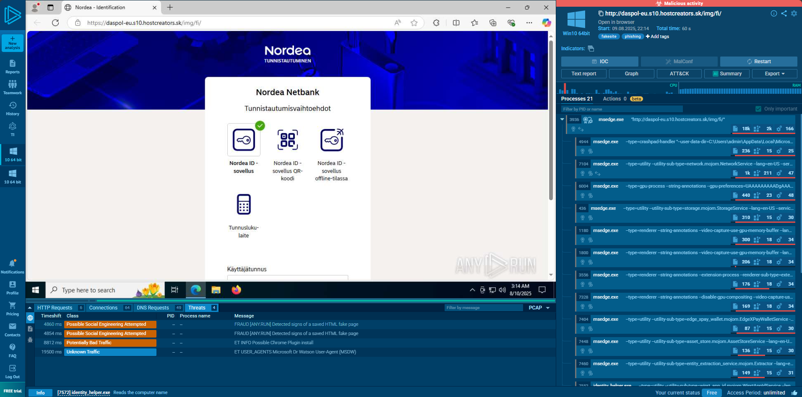  
*Any.Run sandbox overview capturing browser process activity*  

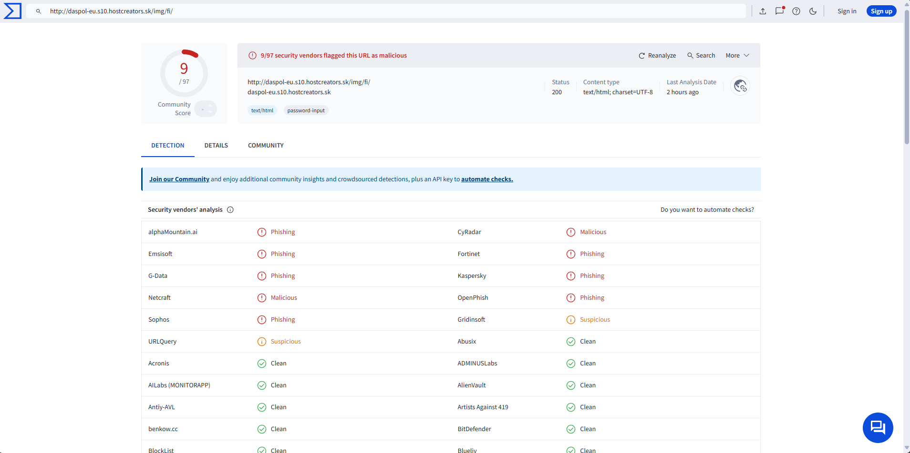  
*VirusTotal scan results showing suspicious flags*  

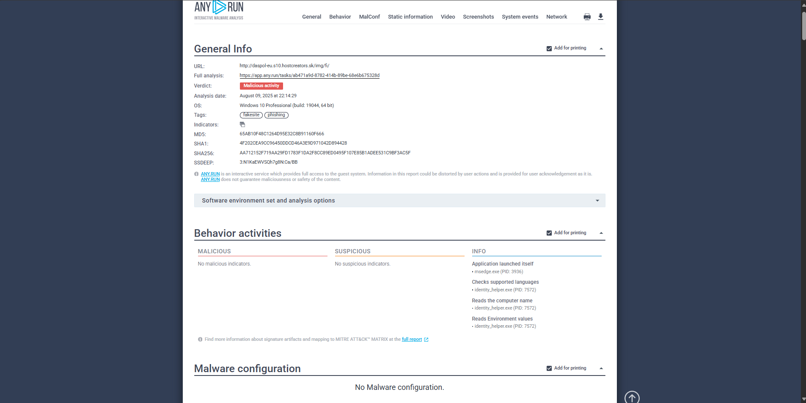  
*Dynamic sandbox analysis of process and file activity*  

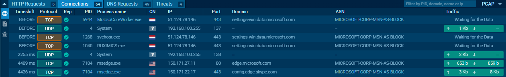  
*Network connections established during analysis*  

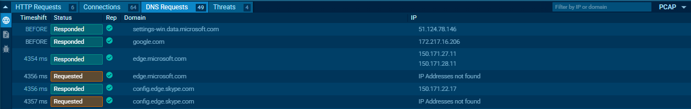  
*DNS requests logged in Any.Run sandbox*  

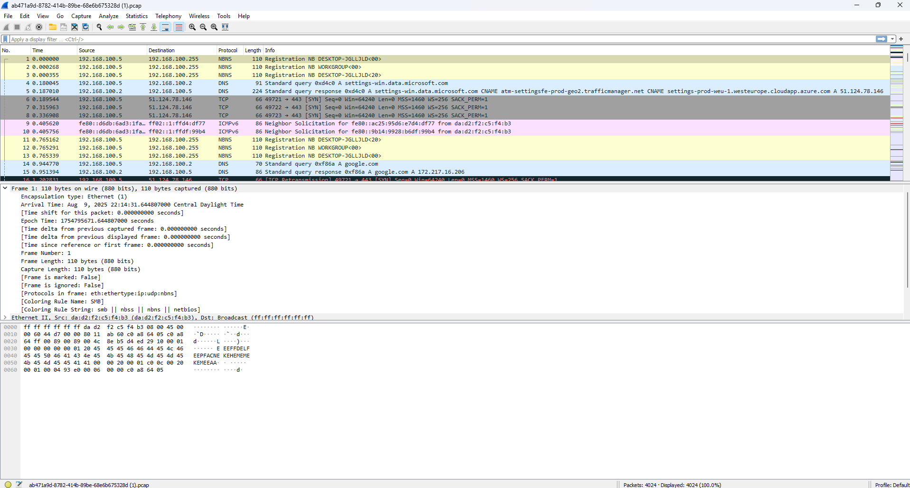  
*Wireshark capture of DNS traffic during sandbox analysis*  

---

### Nvq0qc VirusTotal Scan  
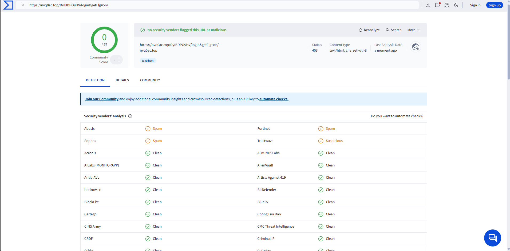  
*VirusTotal scan results showing no significant detections*  

---

### Serviceuzg Phishing URL Analysis  
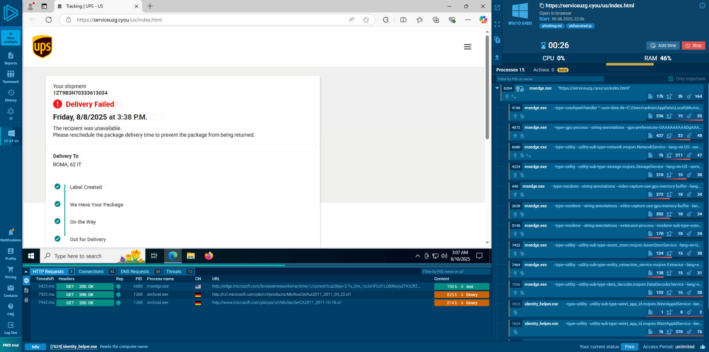  
*Any.Run sandbox overview capturing browser process activity*  

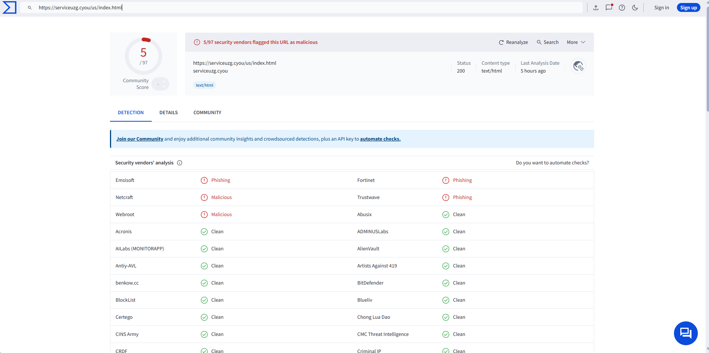  
*VirusTotal scan results showing suspicious flags*  

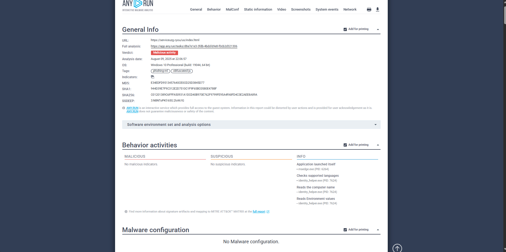  
*Dynamic sandbox analysis of process and file activity*  

  
*Network connections established during analysis*  

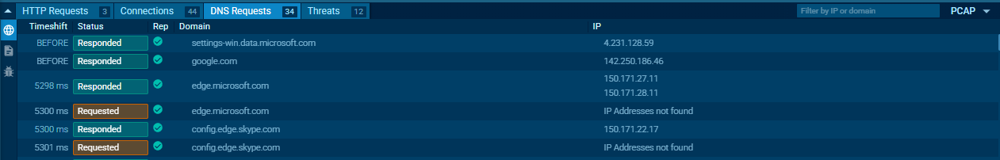  
*DNS requests logged in Any.Run sandbox*  

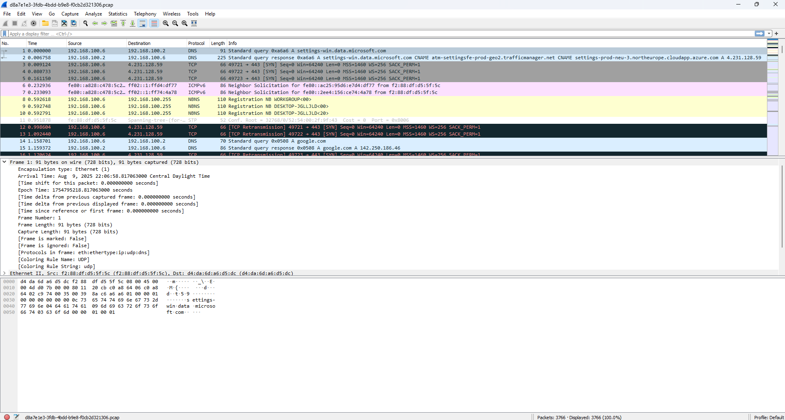  
*Wireshark capture of DNS traffic during sandbox analysis*  

---

## Project Files  
- [Phishing Email Investigation Report](Phishing_Email_Investigation_Report.pdf)  
- Screenshots are located in the `screenshots` folder  

---

## Skills Demonstrated  
- Threat Analysis  
- Malware Analysis  
- Incident Response  
- Network Security  
- Cybersecurity  

---

Feel free to explore the report and screenshots to learn more about this phishing investigation project.
