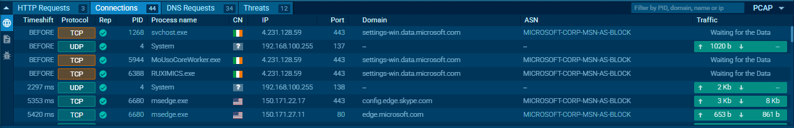

# Phishing Email Investigation

This project involves analyzing phishing URLs sourced from PhishTank using VirusTotal, Any.Run sandbox, and Wireshark.

## Summary
- Conducted multi-engine threat scanning  
- Performed dynamic sandbox analysis to observe malicious behaviors  
- Extracted Indicators of Compromise (IOCs) including malicious URLs, file hashes, and network activity  
- Compiled findings into a professional investigation report  

## Project Files
- `Phishing_Email_Investigation_Report.pdf`  
- Screenshots are located in the `screenshots` folder  

## Sample Screenshots

### Daspol Phishing URL Analysis
  
  
  
  
  
  

### Nvq0qc VirusTotal Scan
  

### Serviceuzg Phishing URL Analysis
  
  
  
  
  
  

## Skills Demonstrated
- Threat Analysis  
- Malware Analysis  
- Incident Response  
- Network Security  
- Cybersecurity  

Feel free to explore the report and screenshots to learn more about this phishing investigation project.
